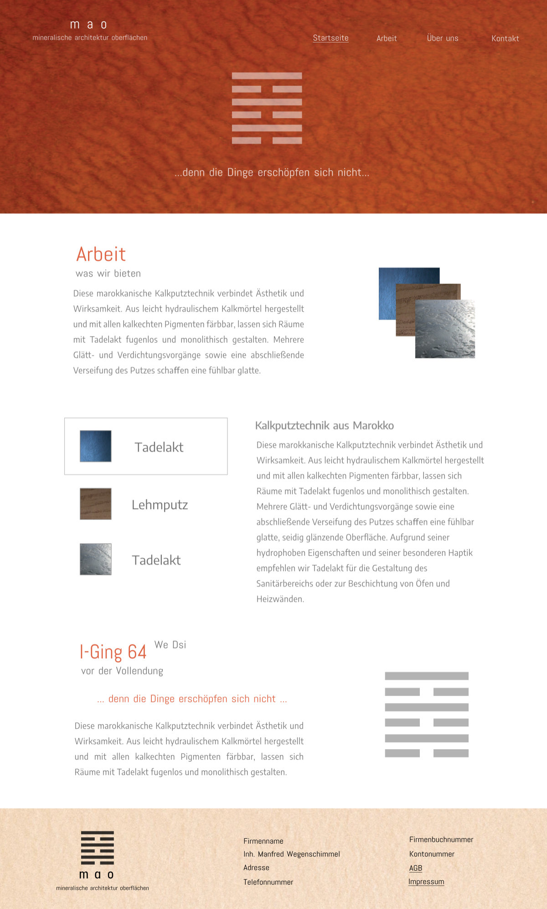

# Tadelakt Website

This repository contains a nextjs website template for [tadelakt.at](https://tadelakt.at).



## Restored live-site baseline

This checkout reconstructs the deployment inspected on 2 October 2026 from
commit `b89e4f3`, with the later deployed fonts, contact wording and privacy text.
See [restoration notes](docs/live-state-restoration.md) for evidence and the
differences between the live HTML and JavaScript.

The source now uses Next.js 16, React 19 and TypeScript 7, while retaining the
German content, local fonts, original images and Apache static hosting.
See [dependency migration notes](docs/dependency-upgrade.md) for the upgrade decisions.

Use Node.js 24+ and npm 11:

```sh
npm ci
npm run dev
```

To build the Apache static export:

```sh
npm run build
```

Deploy the complete `out/` directory, including `.htaccess`; no Node.js server
is required on the host. `npm start` previews this export locally on port 3000
(override with `PORT`).

## Checks

```sh
npx playwright install chromium
npm run check
```

`check` runs Biome, TypeScript, Node tests, the production build and Chromium
e2e tests against the export on port 4173. `npm run format` applies Biome fixes.
The Apache verification instructions are in the migration notes.
